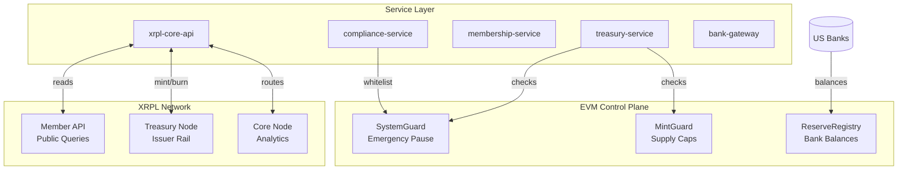

# FTH XRPL Backbone

[](https://github.com/kevanbtc/FTHUSDF/actions/workflows/ci.yml)
[](LICENSE)
[](https://xrpl.org)
[](https://soliditylang.org)

Enterprise-grade digital settlement infrastructure combining XRPL's instant finality with EVM-based control plane guardrails. Powers two stablecoins: **FTHUSD** (institutional USD-backed) and **USDF** (member payment rail).

## Architecture



## Core Invariants

1. **Supply ≤ Reserves**: `FTHUSD_supply ≤ USD_reserves_in_banks`
2. **No Mints When Paused**: `SystemGuard.isPaused() => canMint = false`
3. **Whitelist Required**: All participants must pass KYC/AML
4. **Supply Cap Enforced**: `totalNetMinted + amount ≤ supplyCap`

## Quick Start

### Prerequisites

- Node.js 20+
- PNPM 9+

### Installation

```bash
# Clone and install
git clone https://github.com/kevanbtc/FTHUSDF.git
cd fth-xrpl-backbone
pnpm install
```

### Configuration

```bash
# Copy environment template
cp .env.example .env

# Edit .env with your settings:
# - XRPL node URLs (core, treasury, member-api)
# - EVM contract addresses
# - Service ports
# - Test gating flags
```

### Build & Test

```bash
# Compile contracts
pnpm hardhat compile

# Run all tests (network checks disabled by default)
npm test

# Enable live integration tests
export XRPL_HEALTH_ENABLED=1
export XRPL_INVARIANTS_ENABLED=1
export XRPL_SUPPLY_CHECK_ENABLED=1
export COMPLIANCE_SANCTIONS_ENABLED=1
npm test
```

## Project Structure

```
fth-xrpl-backbone/
├── contracts/              # EVM control plane (Solidity 0.8.20)
│   ├── SystemGuard.sol     # Emergency pause mechanism
│   ├── MintGuard.sol       # Supply cap enforcement
│   └── ReserveRegistry.sol # Bank balance aggregation
├── services/               # TypeScript microservices
│   ├── xrpl-core-api/      # XRPL node routing
│   ├── compliance-service/ # KYC/AML/sanctions
│   ├── membership-service/ # NFT issuance
│   ├── treasury-service/   # Mint/burn orchestration
│   └── bank-gateway/       # Reserve updates
├── tests/
│   ├── contracts/          # Smart contract unit tests
│   ├── infra/              # XRPL health & invariants
│   └── compliance/         # KYC/sanctions scenarios
├── docs/
│   ├── ARCHITECTURE.md     # System design (C4)
│   ├── SUMMARY.md          # Complete documentation index
│   ├── THREAT-MODEL.md     # STRIDE analysis
│   └── RUNBOOKS/           # Operational procedures
└── infra/                  # Node configuration
```

## Documentation

- **[Architecture](docs/ARCHITECTURE.md)**: System design and component interactions
- **[Complete Index](docs/SUMMARY.md)**: Full documentation table of contents with diagrams
- **[Threat Model](docs/THREAT-MODEL.md)**: STRIDE security analysis
- **[API Overview](docs/API/overview.md)**: Service endpoints reference
- **[Operational Runbooks](docs/RUNBOOKS/operational-runbooks.md)**: Day-2 operations
- **[KYC/AML Policy](docs/KYC-AML-POLICY-US.md)**: US compliance framework
- **[Proof of Reserves](docs/STABLECOIN-POR-POLICY.md)**: Daily reconciliation procedures

## Smart Contracts

| Contract | Purpose | Key Functions |
|----------|---------|---------------|
| **SystemGuard** | Global circuit breaker | `pause()`, `unpause()`, `isPaused()` |
| **MintGuard** | Supply cap enforcement | `canMint()`, `confirmMint()`, `recordBurn()` |
| **ReserveRegistry** | USD reserve tracking | `addReserve()`, `updateReserve()`, `totalReservesUsd()` |

All contracts use OpenZeppelin's AccessControl for role-based permissions and are deployed with multi-sig governance.

## Service Layer

| Service | Port | Purpose |
|---------|------|---------|
| **xrpl-core-api** | 8080 | Node routing, payments, trustlines |
| **compliance-service** | 8081 | KYC/AML/sanctions screening |
| **treasury-service** | 8082 | Mint/burn orchestration with guard checks |
| **membership-service** | TBD | NFT issuance and wallet registry |
| **bank-gateway** | TBD | Bank integration and reserve updates |

## Testing

### Contract Tests (53 tests)

```bash
pnpm test:contracts
```

Validates MintGuard, ReserveRegistry, and SystemGuard behavior including:

- Role-based access control
- Cap enforcement
- Reserve checks
- Pause mechanism
- Event emissions

### Infrastructure Tests (4 tests, gated)

```bash
# Requires live XRPL nodes
export XRPL_HEALTH_ENABLED=1
export XRPL_INVARIANTS_ENABLED=1
export XRPL_SUPPLY_CHECK_ENABLED=1
pnpm test:infra
```

Checks:

- Node health and sync status
- Supply ≤ reserves invariant
- XRPL ↔ EVM supply consistency

### Compliance Tests (1 test, gated)

```bash
# Requires compliance service running
export COMPLIANCE_SANCTIONS_ENABLED=1
pnpm test:compliance
```

## Security

- **Key Management**: Issuer keys in cold storage (HSM/MPC), treasury keys warm, services scoped
- **Access Control**: Multi-sig guardian committee for SystemGuard pause/unpause
- **Network Security**: Treasury node VPN-only, member API rate-limited, core node internal VPC
- **Monitoring**: Node health checks, invariant alerts, sanctions screening, failed mint logging

See [THREAT-MODEL.md](docs/THREAT-MODEL.md) for complete STRIDE analysis.

## Deployment

### EVM Contracts

```bash
npx hardhat compile
npx hardhat run scripts/deploy.ts --network <network>
```

### Service Deployment

```bash
# Configure each service
cd services/<service-name>
cp .env.example .env
# Edit .env

# Start service
pnpm dev
```

See [operational runbooks](docs/RUNBOOKS/operational-runbooks.md) for production deployment procedures.

## Contributing

1. Read [CONTRIBUTING.md](CONTRIBUTING.md)
2. Follow the [pull request template](.github/pull_request_template.md)
3. Update diagrams in `docs/SUMMARY.md` when changing flows
4. Add tests for any invariant or policy changes
5. Ensure all tests pass with network checks disabled: `npm test`

## License

[MIT](LICENSE)

## Contact

- **Organization**: FutureTech Holding Company
- **Repository**: [github.com/kevanbtc/FTHUSDF](https://github.com/kevanbtc/FTHUSDF)
- **Documentation**: See [docs/SUMMARY.md](docs/SUMMARY.md)

---

**Production Status**: Operational blueprint. Smart contracts, services, and tests are complete. See [docs/SUMMARY.md](docs/SUMMARY.md) for complete system documentation including mint/burn flows, node topology, and compliance policies.
