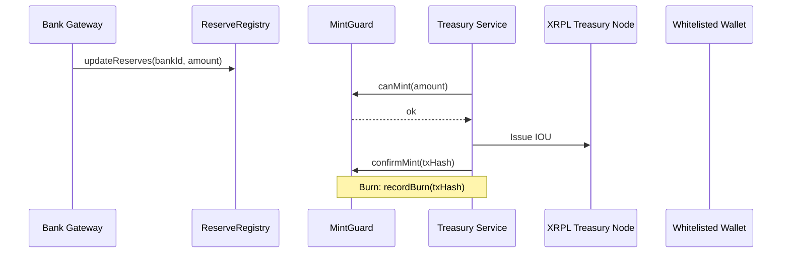
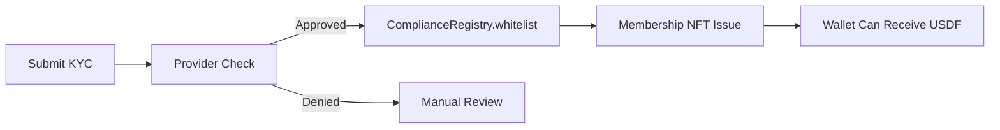
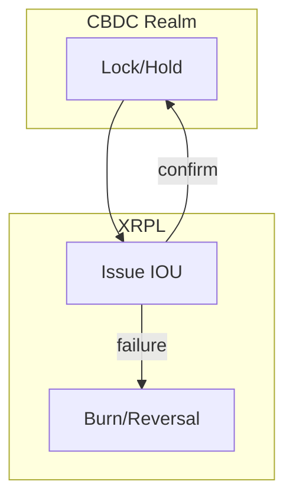
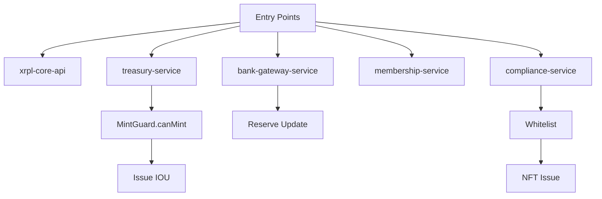
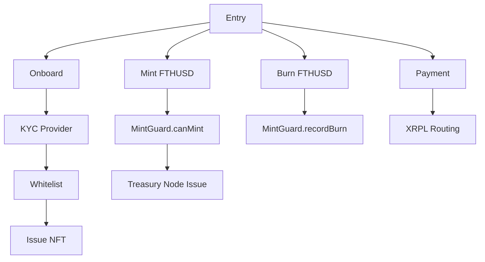

# FTH XRPL Backbone – FTHUSD / USDF Infrastructure

This repo is the **authoritative reference** for Future Tech Holdings' XRPL-based
stablecoin and membership infrastructure.

It describes:

- The XRPL node fleet (core / treasury / member-api)
- FTHUSD (treasury stablecoin) and USDF (client rail)
- KYC/AML and sanctions controls
    - `FTHUSD` – USD-backed institutional stablecoin
# FTHUSDF – FTH Digital Finance Backbone 🚀

    

Sovereign XRPL + EVM guardrails for instant, auditable settlement. Two IOUs (FTHUSD institutional, USDF member rail) with mathematical solvency, Proof‑of‑Reserves, multi‑sig safety, and global expansion (India + CBDC gateway).

> ⚠️ No secrets or private keys. This repo is doctrine + scaffolding.

## 📚 Table of Contents

1. 🔭 Overview
2. 🧩 Architecture at a Glance
3. 🎨 Diagrams & Flow Trees
4. 🧰 Services (Senior Engineering)
5. 🛡️ Smart Contracts Control Plane
6. 🔒 Invariants & Security Model
7. 🧑‍💻 Developer Guide
8. 📣 Marketing / Value Narrative
9. 🌐 India & 🪙 CBDC Interop
10. 🔗 Docs Index & Quick Links
11. 📊 SLO / Infrastructure Map
12. 🌳 System Flow Trees
13. ✨ Value Snapshots
14. 🤝 Contributing
15. 📄 License

---

## 🔭 Overview

- 3 XRPL nodes: Core | Treasury | Member API
- Control Plane (EVM): SystemGuard, MintGuard, ReserveRegistry, ComplianceRegistry, MembershipNFTRegistry
- Tokens: FTHUSD (USD‑backed), USDF (rail; backed by FTHUSD vault)
- Membership NFTs: KYC credential & tier gating
- Daily PoR reconciliation + monthly attestations
- India & CBDC expansion strategy baked in

---

## 🧩 Architecture at a Glance

```mermaid
flowchart TB
  subgraph XRPL[XRPL Network]
    CORE[Core Node]\n(analytics/routing)
    TREAS[Treasury Node]\n(issuer rail)
    MEMAPI[Member API Node]\n(client reads)
  end

  subgraph Services[Service Layer]
    XAPI[xrpl-core-api]\n(routes & ledger ops)
    COMP[compliance-service]\n(KYC/sanctions)
    MEMB[membership-service]\n(NFT + registry)
    TREA[treasury-service]\n(mint/burn orchestration)
    BANK[bank-gateway-service]\n(reserve importer)
  end

  subgraph EVM[Control Plane (EVM)]
    SYS[SystemGuard]\n(pause)
    MINT[MintGuard]\n(caps & canMint)
    RSV[ReserveRegistry]\n(bank balances)
    KYC[ComplianceRegistry]\n(whitelist/risk)
    NFT[MembershipNFTRegistry]\n(optional mirror)
  end

  BANKS[(Bank Accounts)]

  BANK -- feeds balances --> RSV
  COMP -- writes/reads --> KYC
  MEMB -- mints --> NFT
  TREA -- checks --> MINT
  TREA -- checks --> SYS
  XAPI <---> CORE
  XAPI <---> TREAS
  XAPI <---> MEMAPI
  TREA --> TREAS
```

Legend: 🛡️ Guard | 🧰 Service | 🧭 Routing | 🏦 Bank | 🔒 Compliance | 🧱 Node

---

## 🎨 Diagrams & Flow Trees

### 🔁 Mint/Burn Sequence



### ✅ KYC → Membership



### 🪙 CBDC Gateway (Two‑Phase Commit)



### 🌳 System Entry Flow Tree



---

## 🧰 Services (Senior Engineering)

| Service | Purpose | Endpoints / Key Files |
|---------|---------|-----------------------|
| xrpl-core-api | Node routing, payments, ledger reads | `POST /xrpl/payment`, `src/xrplClient.ts` |
| compliance-service | KYC/sanctions + whitelist/risk | `POST /customers/onboard`, `src/kycProvider.ts` |
| membership-service | NFT issuance & wallet registry | `mintMembershipNFT()`, `src/nftMinter.ts` |
| treasury-service | Mint/burn orchestration | `mintFTHUSD()`, `src/guardClient.ts` |
| bank-gateway-service | Import bank balances → reserves | `src/bankImporter.ts` |

---

## 🛡️ Smart Contracts Control Plane

| Contract | Role | Critical Methods |
|----------|------|------------------|
| SystemGuard | Global pause | `pause()`, `unpause()`, `isPaused()` |
| MintGuard | Mint/burn gating & caps | `canMint()`, `confirmMint()`, `recordBurn()` |
| ReserveRegistry | Aggregated reserves | `addReserve()`, `updateReserve()`, `totalReservesUsd()` |
| ComplianceRegistry | Whitelist + risk tiers | `whitelist()`, `block()`, `isWhitelisted()` |
| MembershipNFTRegistry | Optional NFT mirror | `mintTier()`, `revoke()` |

Invariants:

- FTHUSD_supply ≤ total_USD_reserves
- USDF_supply ≤ FTHUSD_in_vault

---

## 🔒 Invariants & Security Model

- Segregated roles: guardians vs treasury vs compliance
- Multi‑sig (3‑of‑5) for global pause
- Issuer keys HSM/MPC; treasury warm; service keys least‑privilege
- Continuous monitoring: ledger age, peer count, supply/reserves drift
- Auto‑pause triggers on invariant breach

---

## 🧑‍💻 Developer Guide

```powershell
# Install
pnpm install

# Compile contracts
pnpm --filter contracts run build

# Run services (examples)
pnpm --filter xrpl-core-api run dev
pnpm --filter treasury-service run dev

# Test all
pnpm test
```

Recommended VS Code Extensions: Solidity, ESLint, Prettier, YAML

---

## 📣 Marketing / Value Narrative

Enterprise‑grade programmable settlement with compliance and cryptographic guardrails: faster treasury rotation, reduced counterparty risk, transparent reserves, multi‑market expansion readiness.

Vertical impact:

- Aviation: maintenance reserve streaming
- Energy: PPA settlement, impact tokenization
- Real Estate: project disbursements & tenant rewards
- Trading: internal FX rail + XRPL DEX access
- Education/CSR: stipend automation with NFTs

---

## 🌐 India & 🪙 CBDC Interop

India: UPI/BBPS payouts via partner; CKYC/AA integration; Mumbai node; DPDP alignment; careful Aadhaar posture.
CBDC: Two‑phase commit gateway, audit artifacts, reversibility, regulator domain separation.

---

## 🔗 Docs Index & Quick Links

- Whitepaper → `docs/WHITEPAPER-FTH-DIGITAL-FINANCE.md`
- Exec Summary → `docs/EXECUTIVE-SUMMARY.md`
- India Strategy → `docs/INDIA-STRATEGY-AND-COMPLIANCE.md`
- CBDC Interop → `docs/CBDC-INTEROPERABILITY.md`
- Global Rollout → `docs/GLOBAL-ROLL-OUT-PLAYBOOK.md`
- FAQ → `docs/FAQ.md`
- One‑Pager → `docs/ONE-PAGER.md`

---

## 📊 SLO / Infrastructure Map

| Component | Role | SLO Targets | Notes |
|-----------|------|-------------|-------|
| Core Node | Analytics/Routing | p95 latency <2s; peers ≥5 | Internal VPC, read optimized |
| Treasury Node | Issuance Rail | p95 mint <5s; restricted access | VPN/IP allowlist, HSM/MPC keys |
| Member API Node | Client Reads | p95 latency <2s; rate limited | WAF + auth throttling |
| SystemGuard | Pause Control | RTO <1m | Multi‑sig guardians |
| MintGuard | Mint/Burn Gate | 99.99% logic consistency | Blocks on pause or insufficient reserves |
| ReserveRegistry | Reserve Truth | Daily PoR pass; drift <0.1% | Fed by bank importer |
| ComplianceRegistry | Whitelist/Risk | p95 decision <2s | Provider + caching layer |

---

## 🌳 System Flow Trees



---

## ✨ Value Snapshots

- 🚀 Instant settlement (T+0) with programmable logic
- 🔒 Mathematical solvency + auto‑pause
- 🧠 Observability + guardrails = lower ops risk
- 🌍 Built for multi‑region + CBDC evolution
- 🧾 Auditable PoR + compliance trail

---

## 🤝 Contributing

1. Branch from `main`
2. Keep architecture diagrams in sync when changing flows
3. Add tests for any invariant or policy changes
4. Run full test suite before PR
5. Update docs index if adding major artifacts

---

## 📄 License

MIT
