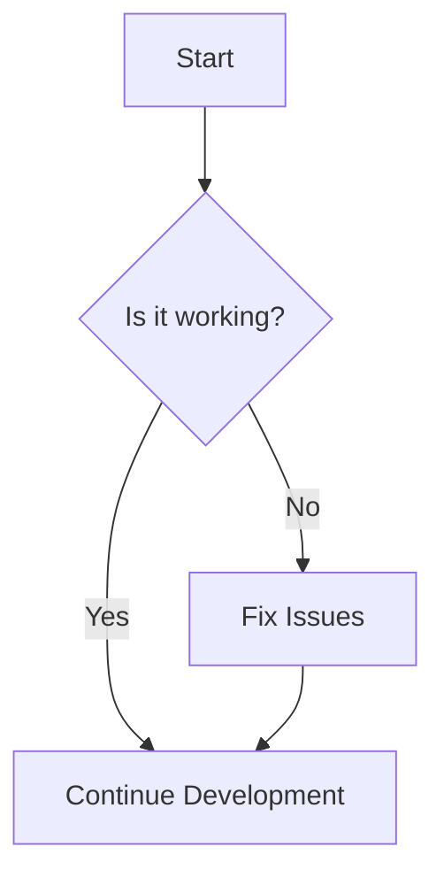

# FTH XRPL Backbone — FTHUSD / USDF Infrastructure

    

For the professional, senior-grade README with diagrams and quick links, see `docs/README-HQ.md`.

---

# FTHUSDF Project

Welcome to the FTHUSDF project! Here you’ll find everything you need to know about the project, its features, and how to get started! 🚀

## 📖 Table of Contents

1. [Introduction](#introduction)
2. [Features](#features)
3. [Installation](#installation)
4. [Usage](#usage)
5. [Contributing](#contributing)
6. [License](#license)

## 👋 Introduction

FTHUSDF is a project designed to ...

## 🔥 Features

- **Feature 1**: Description of feature 1 with an emoji! 🎉
- **Feature 2**: Description of feature 2 with an emoji! 🌟
- **Feature 3**: Description of feature 3 with an emoji! 🛠️

## ⚙️ Installation

To install, clone the repository and install the dependencies:

```bash
git clone https://github.com/kevanbtc/FTHUSDF.git
cd FTHUSDF
npm install
```

## 🛠️ Usage

To run the project, use:

```bash
npm start
```

## 🤝 Contributing

We welcome contributions! Please follow these steps:
1. Fork the repository 
2. Create your feature branch (`git checkout -b feature/fooBar`)
3. Commit your changes (`git commit -m 'Add some fooBar'`)
4. Push to the branch (`git push origin feature/fooBar`)
5. Open a Pull Request

## 📄 License

This project is licensed under the MIT License - see the [LICENSE](LICENSE) file for details.

## 📊 Flowchart



---

Thank you for visiting the FTHUSDF project! We hope you find it useful! 🌈