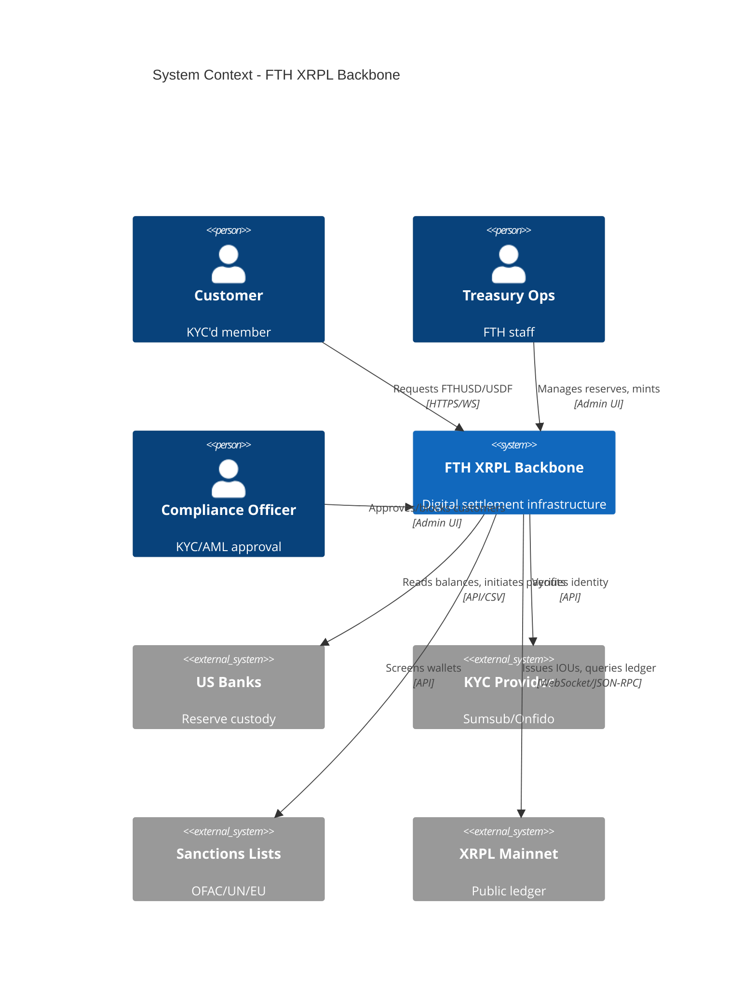
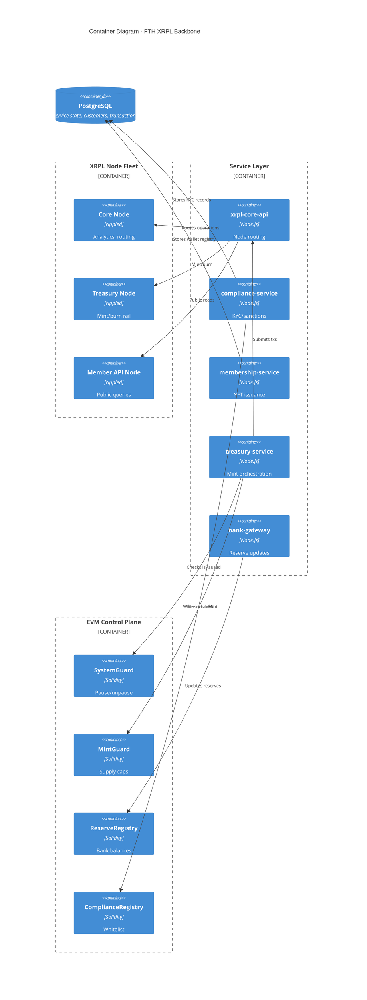

# FTH XRPL Backbone – System Architecture

## 1. Purpose

This document describes the **end-to-end architecture** of the FTH XRPL backbone:

- 3-node XRPL fleet
- FTHUSD / USDF token flows
- Control-plane smart contracts
- Service layer
- Bank integrations
- Safety and compliance controls

It is written at a senior engineering + compliance level and is considered
**source of truth** for how the system is structured.

---

## 2. XRPL Node Fleet

### 2.1 Roles

- **Core Node**
  - Primary RPC/WS endpoint for:
    - Trading bots
    - Analytics
    - Indexers
  - Exposed internally only.
  - Can be rotated without impacting mint/burn authority.

- **Treasury Node**
  - Canonical node for:
    - FTHUSD / USDF mint and burn transactions
    - Treasury wallet operations
  - RPC is locked to:
    - Treasury and compliance services
    - Restricted admin networks
  - Acts as the *ledger-of-record* for issuer operations.

- **Member API Node**
  - Serves:
    - Member portal
    - Mobile apps
    - External dashboards
  - Rate-limited and monitored.
  - No issuer keys are ever used via this node.

### 2.2 Routing

A central routing config (`infra/xrpl.nodes.json`) defines:

- Node endpoints
- Roles (`core`, `treasury`, `member_api`)
- Health priorities

All XRPL calls in services must go through a routing layer, never direct hostnames.

---

## 3. Token Model

### 3.1 FTHUSD

- Type: USD-backed institutional stablecoin (XRPL IOU)
- Issuer: `FTHUSD_Issuer` (XRPL account, cold-controlled)
- Treasury wallets:
  - `FTHUSD_Treasury`
  - Optional: `FTHUSD_Redemption`, `FTHUSD_Vault_USDFBacking`
- Policy:
  - 1:1 backing by USD reserves in US bank accounts
  - Supply constrained by on-chain `MintGuard` + `ReserveRegistry` invariants

### 3.2 USDF

- Type: USD-linked client rail / payment token (XRPL IOU)
- Issuer: `USDF_Issuer`
- Backing model:
  - USDF is backed by FTHUSD held in a designated vault wallet.
- Used for:
  - Member balances
  - Internal payments
  - Loyalty / rewards (subject to terms)

### 3.3 Membership NFTs

- Purpose: prove that a wallet is KYC'd and authorized.
- Minted per wallet after KYC approval.
- Metadata includes:
  - tier: `basic | pro | otc | internal`
  - kyc_status: `approved`
  - jurisdiction: `US`
  - expiry timestamp
- System rule:
  - No FTHUSD/USDF issuance to wallets lacking an active membership NFT.

---

## 4. EVM Control Plane

The EVM contracts act as a **rules engine** for XRPL operations.

- **ComplianceRegistry**
  - Maps off-chain KYC'd entities to allowed identities
  - Provides `isWhitelisted` and `riskTier` queries

- **ReserveRegistry**
  - Stores USD-equivalent reserves per asset
  - Computes `totalReservesUsd`

- **MintGuard**
  - Tracks net supply (minted – burned)
  - Enforces:
    - `totalNetMinted + amount <= globalCap`
    - `totalNetMinted + amount <= totalReservesUsd`
    - System not paused

- **SystemGuard**
  - Global pause / emergency mode switches
  - Access controlled via multi-sig / governance

- **MembershipNFTRegistry**
  - Optional mirrored view of membership entitlements

Supply, reserve, and pause invariants are tested under `tests/contracts/`.

---

## 5. Service Layer

### 5.1 XRPL Core API

Responsibility: canonical gateway to XRPL nodes.

- Exposes REST endpoints:
  - `POST /xrpl/payment`
  - `POST /xrpl/trustline`
  - `GET /xrpl/account/:address`
  - `GET /xrpl/orderbook`
  - `GET /health`
- Internally selects node based on role (`core`, `treasury`, `member_api`).
- Logs all calls for audit.

### 5.2 Compliance Service

Responsibility: KYC/AML + sanctions enforcement.

- Integrates with 3rd-party KYC providers.
- Writes results to internal DB and `ComplianceRegistry` contract.
- Provides:
  - `POST /customers` – start onboarding
  - `POST /customers/:id/approve`
  - `GET /customers/:id/status`

### 5.3 Membership Service

Responsibility: wallet + membership NFT lifecycle.

- Synthesizes:
  - `customer_id` → `wallet` → `membership NFT`
- Uses `xrpl-core-api` to:
  - Mint NFTs from membership issuer account

### 5.4 Treasury Service

Responsibility: mint / burn orchestration.

- For mint:
  - Confirms:
    - KYC/whitelist
    - Reserves updated
    - MintGuard allows
  - Emits `requestMint` on MintGuard
  - Uses `treasury` node to send XRPL Payments
  - Calls `confirmMint` with tx hash

- For burn:
  - Watches redemption wallets
  - Calls `recordBurn` on MintGuard
  - Triggers bank payouts via Bank Gateway

### 5.5 Bank Gateway Service

Responsibility: ingest US bank data and update reserves.

- Reads:
  - CSV exports / API responses from banks
- Updates:
  - `fiat_accounts`
  - `fiat_transactions`
  - `ReserveRegistry` with USD reserve totals

---

## 6. Safety & Compliance

Key invariants:

- `FTHUSD_supply <= USD_reserves` at all times
- `USDF_supply <= FTHUSD_backing_balance`
- No mint operations while `SystemGuard` is paused
- No issuance to non-KYC'd or sanctioned wallets

These invariants are enforced via:

- EVM contracts
- Node topology (treasury node isolation)
- Service checks
- Test suites (`tests/infra`, `tests/compliance`, `tests/contracts`)

See `docs/STABLECOIN-POR-POLICY.md` and `docs/KYC-AML-POLICY-US.md` for further detail.

---

## 7. C4 Model Views

### 7.1 System Context

### 7.2 Container View

### 7.3 Deployment View

#### Production (AWS US-East-1)

- **XRPL Nodes**: 3× EC2 instances (t3.xlarge)
  - Core: Internal VPC
  - Treasury: VPN-only access
  - Member API: Public ALB + WAF
- **Services**: ECS Fargate containers
- **EVM Contracts**: Deployed on Ethereum mainnet (or L2)
- **Database**: RDS PostgreSQL (Multi-AZ)
- **Secrets**: AWS Secrets Manager
- **Monitoring**: CloudWatch + custom dashboards

#### Disaster Recovery

- Treasury node: Hot standby in US-West-2
- Database: Cross-region replication
- Issuer keys: Geographically distributed HSM/MPC
- RPO: < 5 minutes
- RTO: < 15 minutes

---

## 8. Technology Stack

| Layer | Technologies |
|-------|-------------|
| **Ledger** | XRPL (rippled 1.12+) |
| **Smart Contracts** | Solidity 0.8.20, Hardhat, OpenZeppelin |
| **Services** | Node.js 20+, TypeScript 5.x, Express |
| **XRPL Client** | xrpl.js 3.0+ |
| **EVM Client** | ethers.js 6.x |
| **Database** | PostgreSQL 15+ |
| **Testing** | Mocha, Chai, Hardhat |
| **CI/CD** | GitHub Actions |
| **Infrastructure** | AWS (EC2, ECS, RDS, ALB) |

---

## 9. References

- [XRPL Documentation](https://xrpl.org/docs.html)
- [OpenZeppelin Contracts](https://docs.openzeppelin.com/contracts/)
- [C4 Model](https://c4model.com/)
- Internal docs: `docs/SUMMARY.md`
