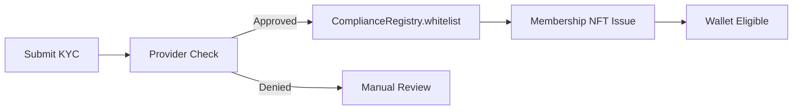
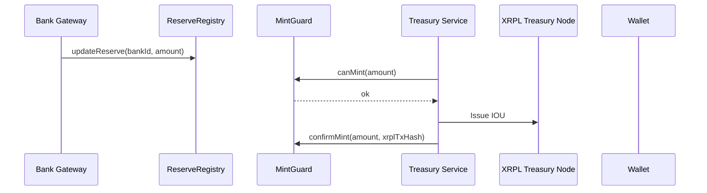
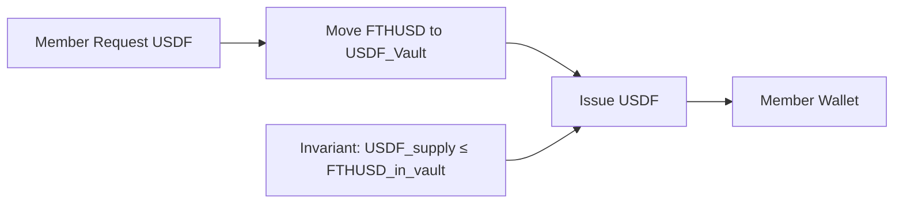
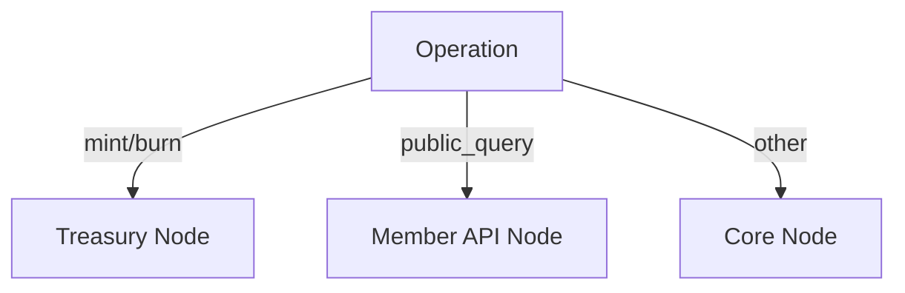
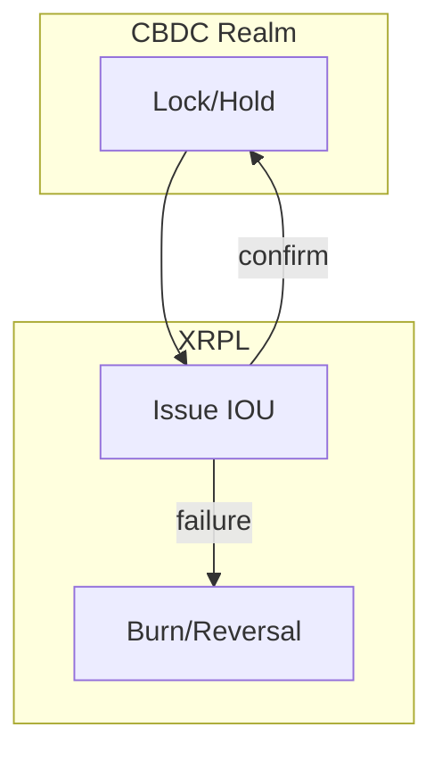

# FTH XRPL Backbone — System Flow Trees & Diagrams

This page consolidates the key senior-level diagrams for architecture reviews, onboarding new engineers, and audit preparation. All flows are aligned with invariants and control-plane enforcement.

---

## High-Level Architecture

```mermaid
flowchart TB
  subgraph XRPL[XRPL Network]
    CORE[Core Node\n(analytics/routing)]
    TREAS[Treasury Node\n(issuer rail)]
    MEMAPI[Member API Node\n(client reads)]
  end

  subgraph Services[Service Layer]
    XAPI[xrpl-core-api\n(routes & ledger ops)]
    COMP[compliance-service\n(KYC/sanctions)]
    MEMB[membership-service\n(NFT + registry)]
    TREA[treasury-service\n(mint/burn orchestration)]
    BANK[bank-gateway-service\n(reserve importer)]
  end

  subgraph EVM[Control Plane (EVM)]
    SYS[SystemGuard\n(pause)]
    MINT[MintGuard\n(caps & canMint)]
    RSV[ReserveRegistry\n(bank balances)]
    KYC[ComplianceRegistry\n(whitelist/risk)]
  end

  BANKS[(Bank Accounts)]

  BANKS -- balances --> RSV
  COMP -- writes/reads --> KYC
  TREA -- checks --> MINT
  TREA -- checks --> SYS
  XAPI <---> CORE
  XAPI <---> TREAS
  XAPI <---> MEMAPI
  TREA --> TREAS
```

---

## Onboarding / Compliance Flow



---

## Mint Sequence (XRPL + EVM Guard)



---

## Reserves Update Pipeline

```mermaid
flowchart LR
  CSV[(Bank CSV/API)] --> PARSE[bank-gateway-service\nparse/import]
  PARSE --> AGG[Aggregate balances]
  AGG --> CALL[ReserveRegistry.updateReserve()]
  CALL --> RSV[ReserveRegistry]
  RSV --> MINTCHK[MintGuard.canMint()]
```

---

## FTHUSD → USDF Conversion



---

## Redemption to USD

```mermaid
flowchart LR
  REDEEM[Member Redeem] --> BURNUSDF[Burn/Lock USDF]
  BURNUSDF --> BURNF[Burn FTHUSD]
  BURNF --> RECORD[MintGuard.recordBurn()]
  RECORD --> PAYOUT[Bank Gateway Payout]
```

---

## Emergency Pause

```mermaid
flowchart LR
  TRIG[Trigger: shortfall / sanctions / keys] --> PAUSE[SystemGuard.pause()]
  PAUSE --> BLOCK[MintGuard.canMint() = false]
  BLOCK --> HALT[All mints halt]
```

---

## Node Routing Logic



---

## CBDC Gateway (Two-Phase Commit)


