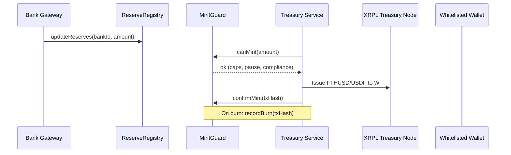
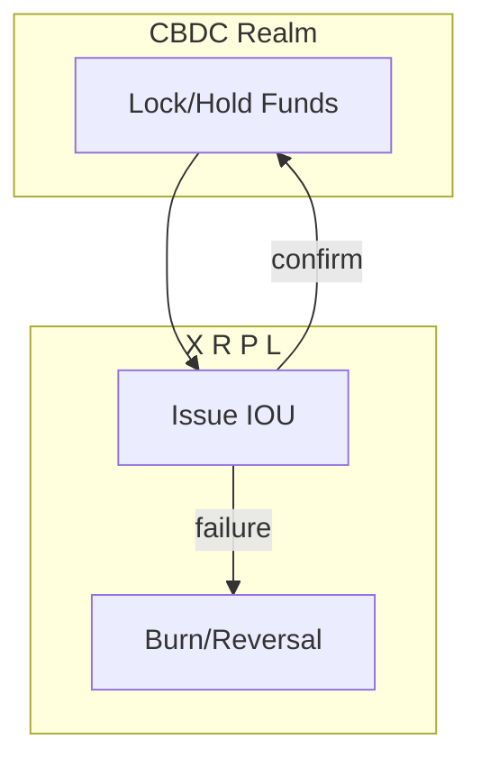

# FTHUSDF – HQ README (Engineering + Marketing)


A production-grade settlement backbone on XRP Ledger with EVM guardrails. It powers instant, auditable money movement for FTH’s verticals with FTHUSD (institutional) and USDF (member rail) tokens, backed by provable reserves and strict compliance.

---

## Table of Contents

- Overview
- Architecture at a Glance
- Diagrams (Mermaid)
- Services Overview (Senior Engineering)
- Smart Contracts (Control Plane)
- Invariants & Security
- Developer Guide (Sr/Dev Level)
- Marketing Overview (High Level)
- India Strategy & CBDC Interop
- Docs Index

---

## Overview

- Three sovereign XRPL nodes with role isolation (core, treasury, member_api)
- EVM control plane for pause, caps, reserves, and whitelisting
- Two XRPL IOUs: FTHUSD (USD-backed) and USDF (member rail)
- Daily Proof-of-Reserves; monthly attestations; emergency pause

---

## Architecture at a Glance

```mermaid
flowchart TB
  subgraph XRPL[XRPL Network]
    CORE[Core Node]\n(analytics/routing)
    TREAS[Treasury Node]\n(issuer rail)
    MEMAPI[Member API Node]\n(client reads)
  end

  subgraph Services[Service Layer]
    XAPI[xrpl-core-api]\n(routes & ledger ops)
    COMP[compliance-service]\n(KYC/sanctions)
    MEMB[membership-service]\n(NFT + registry)
    TREA[treasury-service]\n(mint/burn orchestration)
    BANK[bank-gateway-service]\n(reserve importer)
  end

  subgraph EVM[Control Plane (EVM)]
    SYS[SystemGuard]\n(pause)
    MINT[MintGuard]\n(caps & canMint)
    RSV[ReserveRegistry]\n(bank balances)
    KYC[ComplianceRegistry]\n(whitelist/risk)
    NFT[MembershipNFTRegistry]\n(optional mirror)
  end

  BANKS[(Bank Accounts)]

  BANK -- feeds balances --> RSV
  COMP -- writes/reads --> KYC
  MEMB -- mints --> NFT
  TREA -- checks --> MINT
  TREA -- checks --> SYS
  XAPI <---> CORE
  XAPI <---> TREAS
  XAPI <---> MEMAPI
  TREA --> TREAS
```

Color key: control plane = dark; services = blue; XRPL nodes = indigo; banks = gray.

---

## Diagrams (Mermaid)

### Mint/Burn Flow



### KYC Onboarding Flow

```mermaid
flowchart LR
  A[Submit KYC/KYB] --> B[Provider Check\n(Sumsub/Onfido)]
  B -->|Approved| C[ComplianceRegistry\nwhitelist]
  C --> D[Membership NFT\nissue tier]
  D --> E[Wallet allowed to\nreceive USDF]
  B -->|Denied/Review| F[Manual Review]
```

### CBDC Gateway (Two-Phase Commit)



---

## Services Overview (Senior Engineering)

| Service | Purpose | Key Endpoints/Files |
|---|---|---|
| xrpl-core-api | Node routing, payments, ledger reads | `POST /xrpl/payment`, `src/xrplClient.ts` |
| compliance-service | KYC/sanctions, whitelist/risk tiers | `POST /customers/onboard`, `src/kycProvider.ts` |
| membership-service | NFT issuance and wallet registry | `mintMembershipNFT(wallet, tier)`, `src/nftMinter.ts` |
| treasury-service | Mint/burn orchestration; invariant guard | `mintFTHUSD(req, ctx)`, `src/guardClient.ts` |
| bank-gateway-service | Bank importer → ReserveRegistry | `src/bankImporter.ts` |

---

## Smart Contracts (Control Plane)

| Contract | Summary | Critical Methods |
|---|---|---|
| SystemGuard | Global circuit breaker | `pause()`, `unpause()`, `isPaused()` |
| MintGuard | Caps, canMint/confirm, burn accounting | `canMint()`, `confirmMint()`, `recordBurn()` |
| ReserveRegistry | Bank balances/aggregation | `add/update/remove`, `totalReservesUsd()` |
| ComplianceRegistry | Whitelisting, risk tiers | `whitelist()`, `block()`, `isWhitelisted()` |
| MembershipNFTRegistry | Optional XRPL NFT mirror | `mintTier()`, `revoke()` |

Invariants:

- FTHUSD_supply ≤ total_USD_reserves
- USDF_supply ≤ FTHUSD_in_vault

---

## Invariants & Security

- Separation of duties: guardians (pause), treasury (mint/burn), compliance (whitelist)
- Keys: issuer (HSM/MPC cold), treasury (warm), services (scoped)
- Monitoring: node health, ledger age, peers, invariant checks, PoR deltas
- Audits: code audit, external PoR attestation, logging and runbooks

---

## Developer Guide (Sr/Dev Level)

Prereqs: Node 18+, pnpm, Git, OpenSSL; Solidity 0.8.20 toolchain; XRPL and ethers libraries.

Install & bootstrap:

```powershell
# Install dependencies
pnpm install

# Compile contracts
pnpm --filter contracts run build

# Start services (example)
pnpm --filter xrpl-core-api run dev
pnpm --filter treasury-service run dev
```

Tests (scaffolds included under `tests/`):

```powershell
pnpm test
```

---

## Marketing Overview (High Level)

- Instant settlement with machine-verifiable guardrails
- Lower counterparty/operational risk; better transparency
- Sovereign infrastructure (own nodes); privacy, performance, reliability
- Designed for enterprise: Aviation, Energy, Real Estate, Trading, Education

---

## India Strategy & CBDC Interop

- India: bank/PPI partner-first; UPI/BBPS payouts; CKYC/AA alignment; local Mumbai node; data residency
- CBDC gateway: two-phase commit, audit artifacts, reversibility paths; regulator-friendly design

---

## Docs Index

- Whitepaper: `docs/WHITEPAPER-FTH-DIGITAL-FINANCE.md`
- Executive Summary: `docs/EXECUTIVE-SUMMARY.md`
- India Strategy & Compliance: `docs/INDIA-STRATEGY-AND-COMPLIANCE.md`
- CBDC Interoperability: `docs/CBDC-INTEROPERABILITY.md`
- Global Roll-Out Playbook: `docs/GLOBAL-ROLL-OUT-PLAYBOOK.md`
- FAQ: `docs/FAQ.md`
- One-Pager: `docs/ONE-PAGER.md`

---

## License

MIT
